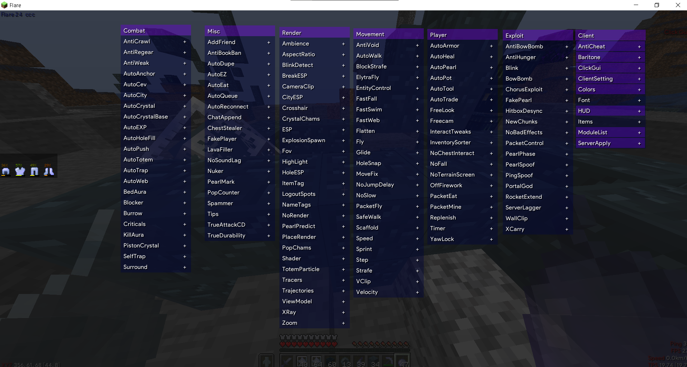

# Flare24 - Minecraft Client Hack (thông tin chính)

Flare24 là một client hack cho Minecraft phiên bản 1.20.4,
phát triển và hoàn thiện bởi team Flare 
//sở dĩ có tên flare24 vì năm nó được 
lên kế hoach và làm ra là năm 2024 chứ
 không phải làm tới phiên bản 24 thực
chất thì bây giờ, tại thời điểm bạn
đang đọc cái readme này thì nó mới
chỉ là phiên bản ( aplha b1 ) 

## Yêu Cầu

- Minecraft 1.20.4
- Fabric Loader
- Fabric API

## Cách cài

1. Tải và cài đặt Minecraft phiên bản 1.20.4.
2. Cài đặt Fabric Loader từ [đây](https://fabricmc.net/use/).
3. Tải Fabric API và chép vào thư mục `mods` của Minecraft.
4. Tải **flare24** từ repository của bạn và chép vào thư mục `mods`.

## bypass

- Grim
- nocheatplus

## ClickGUI

  
ClickGUI

  

## Giấy Phép

Dự án này được phát hành dưới giấy phép [MIT](https://opensource.org/licenses/MIT).

## Liên Hệ
email: [flare.mail](hle816412@gmail.com)
discord :[flare.discord](https://discord.gg/Wtv9D8TdsJ).

---

trân trọng,đội ngũ**flare24**!
